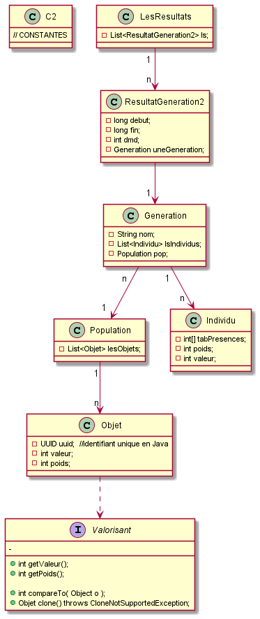

# KNAPSACK_GENETIK
Une résolution du problème de KNAPSACK, par programmation "génétique"
en Java.

Il y a 3 lanceurs dans ce projet:
- LanceurCombinaison: permet de lancer la rechercher en fonction du nombre d'éléments à choisir.
       
       ATTENTION:
       . le maximum est 26
       . le fichier contenant les combinaisons (cfs remarque) doit se nommer "combinaisons26.txt"
 - LecteurFichier: programme permettant de lire le contenu du fichier contenant les combinaisons
 - GenerateurFichier: programme permettant de générer le fichier des combinaisons
 
 REMARQUE: pour les combinaisons j'ai choisi d'utiliser le binaire des nombres de 0 jqa 2^26(67 108 864)
   

